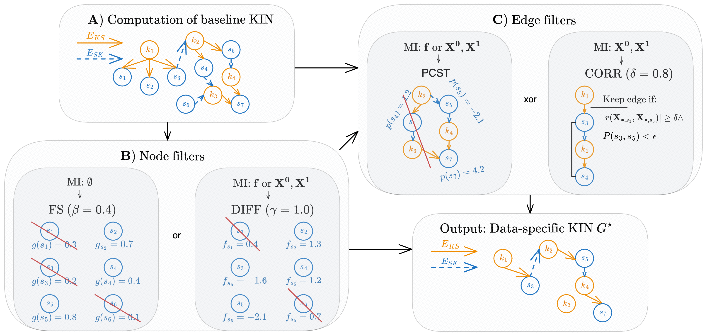

# KINference-Evaluation-Scripts

This repository contains all the necessary code for the evaluation of KINference: Data-driven inference of kinase interaction networks.



## Installation instruction

Install with:
```R
devtools::install_github('bionetslab/KINference')
```

## Run the code for result generation:
Note: You have to run the code from the terminal and not inside an R terminal as the PCST calculation using the python implementatiion of pcst_fast will not work otherwise.
- Wilkes 2015 et al. (https://doi.org/10.1073/pnas.142334411)
```
Rscript Wilkes2015_run.R
```
- Bouhaddou 2023 et al. (https://doi.org/10.1016/j.cell.2023.08.026)
```
Rscript Bouhaddou2023_run.R
```

## Run the hyperparameter evaluation:
Warning: This takes a long time!
```
Rscript run_Hyperparameter_evaluation.R
```

## Recreation of analysis and figures
1) All scripts to recreate the results can be found in the folder `manuscript_scripts`
2) All scripts to recreate the plots can be found in the folder `plotting_scripts`