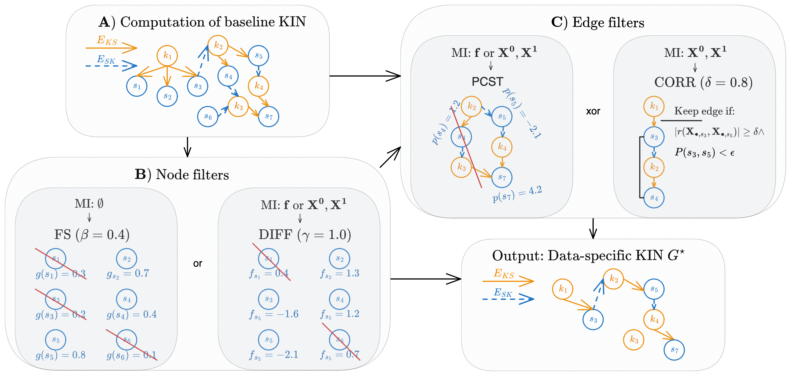

# KINference-Evaluation-Scripts

This repository contains all the necessary code for the evaluation of KINference: Data-driven inference of kinase interaction networks.



## Installation instruction

Install with:
```R
devtools::install_github('bionetslab/KINference')
```

## Recreation of analysis and figures
1) All scripts to recreate the results can be found in the folder `manuscript_scripts`
2) All scripts to recreate the plots can be found in the folder `plotting_scripts`

**NOTE:** You have to run every code from the main repo directory! For example:
```
Rscript manuscript_scripts/Bouhaddou_run.R
``` 

You have to download the `gene2pubmed` and `gene2ensemble` file from https://ftp.ncbi.nih.gov/gene/DATA/ for the `literaturbias_analysis.R` script.